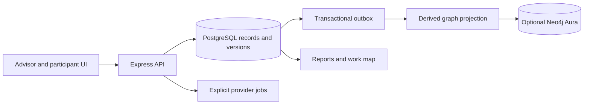

# Architecture and data

## Runtime

React/TypeScript is served by Vite locally and built into static assets. Express implements the API. Local development uses Vite middleware in the same server. Vercel uses `api/index.ts` for the hosted function. PostgreSQL is authoritative; Neo4j is an optional metadata projection.

See [detailed architecture](../ARCHITECTURE.md), [API reference](../API-REFERENCE.md), and [field reference](../FIELD-REFERENCE.md).

## Data concepts

| Concept | Meaning |
| --- | --- |
| Tenant/account | Security and provider-configuration boundary |
| Company | Organization under discovery within that account |
| Person and role | Human context; reporting structure is distinct from task authority |
| Duty | Sustained responsibility |
| Task | Bounded work with inputs, actions, outputs and systems |
| Handoff | Recorded connection between task outputs and next inputs |
| Evidence | Original account/source supporting a description or finding |
| Framework artifact | Structured strategic interpretation with grounding |
| Candidate/manifest | Proposed delegation, separate from execution authority |
| Workflow/case | Defined work path and a bounded instance/snapshot |

Start in `shared/domain.ts`, `shared/work-model.ts`, `shared/workflow.ts`, and `contracts/graph-ontology.json`. Read schemas rather than inferring database columns from this conceptual table.

## Invariants

- Server-resolved tenant/company context controls access; client IDs do not confer permission.
- Runtime database roles are non-superuser, without RLS bypass, and use forced row security.
- Original evidence and content versions remain traceable. Confirmation binds an exact version/hash.
- Concurrency/version checks and idempotent commands protect writes.
- State transitions and evidence acceptance are not interchangeable with rewriting content.
- Provider calls occur outside database transactions; jobs capture provenance and bounded attempts.
- Graph projection lag cannot rewrite the authoritative record.
- Company work-map layout follows actual task/workflow/handoff records; business-type stage templates are not fabricated edges.

## Graphs and storage

Neo4j stores derived metadata/relationships with tenant/company scoping and revision checks. Unavailable or stale projections can fall back to PostgreSQL/current records. The graph should never contain copied raw audio or full transcripts merely to make visualization easier.

Audio currently uses bounded database chunks and retention handling. Scanned object storage and broader lifecycle/compliance controls are future work. Do not describe an object-storage migration as already delivered.

## Where to change things

- Record mutations: `server/records.ts` and shared schemas.
- Discovery/participants: `server/discovery.ts`, `participant-cards.ts`, `task-review.ts`.
- AI/frameworks: `server/ai.ts`, `frameworks.ts`, shared framework specifications.
- Work map: `shared/company-work-map.ts`, `client/src/CompanyWorkMap.tsx`.
- Projection: `server/projection.ts`, `neo4j.ts`, graph query/shape modules.
- Invitations/audio: invitation, assets, and transcription modules.
- Hosted entry/configuration: `api/index.ts`, `vercel.json`, `server/hosted.ts`.

Consult [security](../SECURITY.md) before changing authorization, uploads, provider access, or tokens.
